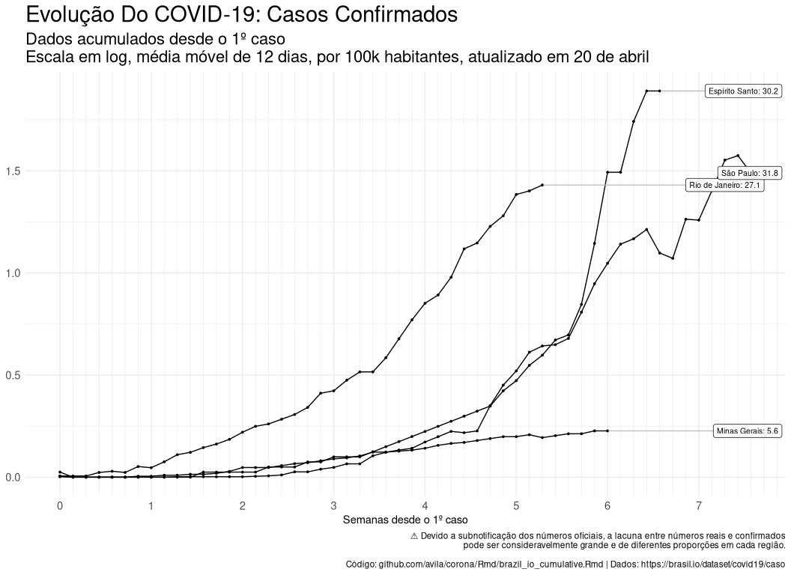

Evoução dos casos e mortes por COVID-19 no Brasil
================
Marcelo Avila
2020-04-21

<!--html_preserve-->

<a href="data:text/x-markdown;base64,LS0tCnRpdGxlOiAiRXZvdcOnw6NvIGRvcyBjYXNvcyBlIG1vcnRlcyBwb3IgQ09WSUQtMTkgbm8gQnJhc2lsIgphdXRob3I6ICJNYXJjZWxvIEF2aWxhIgpkYXRlOiAiYHIgU3lzLkRhdGUoKWAiCm91dHB1dDogZ2l0aHViX2RvY3VtZW50Ci0tLQoKYGBge3Igc2V0dXAsIGluY2x1ZGU9RkFMU0V9CmtuaXRyOjpvcHRzX2NodW5rJHNldChlY2hvID0gVFJVRSwgCiAgICAgICAgICAgICAgICAgICAgICBmaWcuaGVpZ2h0ID0gMTIsCiAgICAgICAgICAgICAgICAgICAgICBmaWcud2lkdGggPSAxMiwKICAgICAgICAgICAgICAgICAgICAgIG1lc3NhZ2UgPSBGQUxTRSwKICAgICAgICAgICAgICAgICAgICAgIHdhcm5pbmcgPSBGQUxTRQopCgojIGZvciBkYXRlcyBpbiBlbmdsaXNoIApzeXNfdGltZV9sb2NhbF9vbGQgPC0gU3lzLmdldGxvY2FsZSgiTENfVElNRSIpClN5cy5zZXRsb2NhbGUoIkxDX1RJTUUiLCAicHRfQlIudXRmOCIpCgojIGF2b2lkIHNjaWVudGlmaWMgbm90YXRpb24Kb3B0aW9ucyhzY2lwZW4gPSA5OTkpCgpgYGAKCmBgYHtyIGRvd25sb2FkIHNvdXJjZSBmaWxlLCBlY2hvPUZBTFNFfQpsaWJyYXJ5KGxlbW9uKQprbml0X3ByaW50LmRhdGEuZnJhbWUgPC0gbGVtb246OmxlbW9uX3ByaW50CmZpbGVuYW1lIDwtICJicmF6aWxfaW9fZGFpbHkuUm1kIgp4ZnVuOjplbWJlZF9maWxlKGZpbGVuYW1lLCBmaWxlbmFtZSwgIkNsaWNrIGhlcmUgdG8gRG93bmxvYWQgc291cmNlIFJNYXJrZG93biBmaWxlIikKYGBgCgoKIyMgbGlicmFyeQoKYGBge3IgbGlicmFyeX0KbGlicmFyeSh0aWR5dmVyc2UpCiNsaWJyYXJ5KGx1YnJpZGF0ZSkKYGBgCgoKIyMgcmVhZCBkYXRhIGZyb20gYXBpIG9yIGF1dG9tYXRpY2FsbHkKCmBgYHtyfQpjb2RfYnIgPC0gcmVhZF9jc3YoJ2VzdGFkbywgc3RhdGUKQWNyZSwgQUMKQWxhZ29hcywgQUwKQW1hcMOhLCBBUApBbWF6b25hcywgQU0KQmFoaWEsIEJBCkNlYXLDoSwgQ0UKRXNww61yaXRvIFNhbnRvLCBFUwpHb2nDoXMsIEdPCk1hcmFuaMOjbywgTUEKTWF0byBHcm9zc28sIE1UCk1hdG8gR3Jvc3NvIGRvIFN1bCwgTVMKTWluYXMgR2VyYWlzLCBNRwpQYXLDoSwgUEEKUGFyYcOtYmEsIFBCClBhcmFuw6EsIFBSClBlcm5hbWJ1Y28sIFBFClBpYXXDrSwgUEkKUmlvIGRlIEphbmVpcm8sIFJKClJpbyBHcmFuZGUgZG8gTm9ydGUsIFJOClJpbyBHcmFuZGUgZG8gU3VsLCBSUwpSb25kw7RuaWEsIFJPClJvcmFpbWEsIFJSClNhbnRhIENhdGFyaW5hLCBTQwpTw6NvIFBhdWxvLCBTUApTZXJnaXBlLCBTRQpUb2NhbnRpbnMsIFRPCkRpc3RyaXRvIEZlZGVyYWwsIERGJykKCmVzdGFkb19jYXBpdGFsIDwtIHJlYWRfY3N2KAonInJlZ2lhbyIsImVzdGFkbyIsInNpZ2xhIiwiY2FwaXRhbCIKIk5vcnRlIiwiQW1hem9uYXMiLCJBTSIsIk1hbmF1cyIKIk5vcnRlIiwiUm9yYWltYSIsIlJSIiwiQm9hIFZpc3RhIgoiTm9ydGUiLCJBbWFww6EiLCJBUCIsIk1hY2Fww6EiCiJOb3J0ZSIsIlBhcsOhIiwiUEEiLCJCZWzDqW0iCiJOb3J0ZSIsIlRvY2FudGlucyIsIlRPIiwiUGFsbWFzIgoiTm9ydGUiLCJSb25kw7RuaWEiLCJSTyIsIlBvcnRvIFZlbGhvIgoiTm9ydGUiLCJBY3JlIiwiQUMiLCJSaW8gQnJhbmNvIgoiTm9yZGVzdGUiLCJNYXJhbmjDo28iLCJNQSIsIlPDo28gTHXDrXMiCiJOb3JkZXN0ZSIsIlBpYXXDrSIsIlBJIiwiVGVyZXNpbmEiCiJOb3JkZXN0ZSIsIkNlYXLDoSIsIkNFIiwiRm9ydGFsZXphIgoiTm9yZGVzdGUiLCJSaW8gR3JhbmRlIGRvIE5vcnRlIiwiUk4iLCJOYXRhbCIKIk5vcmRlc3RlIiwiUGVybmFtYnVjbyIsIlBFIiwiUmVjaWZlIgoiTm9yZGVzdGUiLCJQYXJhw61iYSIsIlBCIiwiSm/Do28gUGVzc29hIgoiTm9yZGVzdGUiLCJTZXJnaXBlIiwiU0UiLCJBcmFjYWp1IgoiTm9yZGVzdGUiLCJBbGFnb2FzIiwiQUwiLCJNYWNlacOzIgoiTm9yZGVzdGUiLCJCYWhpYSIsIkJBIiwiU2FsdmFkb3IiCiJDZW50cm8tT2VzdGUiLCJNYXRvIEdyb3NzbyIsIk1UIiwiQ3VpYWLDoSIKIkNlbnRyby1PZXN0ZSIsIk1hdG8gR3Jvc3NvIGRvIFN1bCIsIk1TIiwiQ2FtcG8gR3JhbmRlIgoiQ2VudHJvLU9lc3RlIiwiR29pw6FzIiwiR08iLCJHb2nDom5pYSIKIkNlbnRyby1PZXN0ZSIsIkRpc3RyaXRvIEZlZGVyYWwiLCJERiIsIkJyYXPDrWxpYSIKIlN1ZGVzdGUiLCJTw6NvIFBhdWxvIiwiU1AiLCJTw6NvIFBhdWxvIgoiU3VkZXN0ZSIsIlJpbyBkZSBKYW5laXJvIiwiUkoiLCJSaW8gZGUgSmFuZWlybyIKIlN1ZGVzdGUiLCJFc3DDrXJpdG8gU2FudG8iLCJFUyIsIlZpdMOzcmlhIgoiU3VkZXN0ZSIsIk1pbmFzIEdlcmFpcyIsIk1HIiwiQmVsbyBIb3Jpem9udGUiCiJTdWwiLCJQYXJhbsOhIiwiUFIiLCJDdXJpdGliYSIKIlN1bCIsIlJpbyBHcmFuZGUgZG8gU3VsIiwiUlMiLCJQb3J0byBBbGVncmUiCiJTdWwiLCJTYW50YSBDYXRhcmluYSIsIlNDIiwiRmxvcmlhbsOzcG9saXMiJykKCmBgYAoKCmBgYHtyIHJlYWQgZGF0YSBmcm9tIGFwaSBvciBhdXRvbWF0aWNhbGx5fQpsIDwtIGxpc3QoKQpwYWdlX3NpemUgPC0gMTAwMDAKdXJsIDwtIHBhc3RlMCgiaHR0cHM6Ly9icmFzaWwuaW8vYXBpL2RhdGFzZXQvY292aWQxOS9jYXNvL2RhdGE/cGFnZV9zaXplPSIsIHBhZ2Vfc2l6ZSkKcGFnZXMgPC0gMjAKZm9yIChpIGluIDE6cGFnZXMpIHsKICBicl9pb19qc29uIDwtIGpzb25saXRlOjpmcm9tSlNPTih1cmwpCiAgbFtbaV1dIDwtIGJyX2lvX2pzb24kcmVzdWx0cwogIGNhdChpLCAiXG4iKQogIGNhdCh1cmwsICJcbiIpCiAgdXJsIDwtIGJyX2lvX2pzb24kYG5leHRgCiAgaWYoaXMubnVsbCh1cmwpKSBicmVhawp9CgpkZiA8LSBsICU+JSBwdXJycjo6cmVkdWNlKHJiaW5kKSAlPiUgdW5pcXVlKCkKaWYgKG5yb3coZGYpPT0ocGFnZV9zaXplICogcGFnZXMpKSB7CiAgc3RvcCgiUmFpc2UgbnVtYmVyIG9mIHBhZ2VzIGJlY2F1c2UgdGhlIGRhdGEgcHJvYmFibHkgZ290IGEgYml0IGJpZ2dlciIpCn0KYGBgCgojIyBjaGFuZ2UgdHlwZXMKCmBgYHtyIGNoYW5nZSB0eXBlc30KZGZfYnIgPC0gZGYgJT4lICBtdXRhdGUoZGF0ZSA9IGx1YnJpZGF0ZTo6ZGF0ZShkYXRlKSkgJT4lIAogIGFycmFuZ2Uoc3RhdGUsIGNpdHksIGRhdGUpICU+JSAKICByZW5hbWUoQ3VtX0Nhc2VzID0gY29uZmlybWVkLCAKICAgICAgICAgQ3VtX0RlYXRocyA9IGRlYXRocykgJT4lIAogIGdyb3VwX2J5KHN0YXRlLCBjaXR5KSAlPiUgCiAgbXV0YXRlKERhaWx5X0Nhc2VzID0gQ3VtX0Nhc2VzIC0gbGFnKEN1bV9DYXNlcywgZGVmYXVsdCA9IDApLCAKICAgICAgICAgRGFpbHlfRGVhdGhzID0gQ3VtX0RlYXRocyAtIGxhZyhDdW1fRGVhdGhzLCBkZWZhdWx0ID0gMCkpICU+JSAKICAgIHBpdm90X2xvbmdlcihjb2xzID0gYyhDdW1fQ2FzZXMsIEN1bV9EZWF0aHMsIERhaWx5X0Nhc2VzKSwgCiAgICAgICAgICAgICAgIG5hbWVzX3RvID0gIkNhdGVnb3J5IikgJT4lIAogIHNlbGVjdChkYXRlLCBzdGF0ZSwgY2l0eSwgQ2F0ZWdvcnksIHZhbHVlLCBldmVyeXRoaW5nKCkpICU+JSAKICBsZWZ0X2pvaW4oZXN0YWRvX2NhcGl0YWwsIGJ5ID0gYygic3RhdGUiID0gInNpZ2xhIikpICU+JSAKICB1bmdyb3VwKCkKICAjZmlsdGVyKGNpdHkhPSJJbXBvcnRhZG9zL0luZGVmaW5pZG9zIikKYGBgCgpgYGB7cn0Kcm0obCwgZGYpCmdjKCkKYGBgCgojIyBmdW5jdGlvbnMKCmBgYHtyIGZ1bmN0aW9uc30KCmZ1bl9kb3QgPC0gZnVuY3Rpb24oeCkgZm9ybWF0KHgsIGJpZy5tYXJrID0gIiAiLAogICAgICAgICAgICAgICAgICAgICAgICAgICAgICBzY2llbnRpZmljID0gRkFMU0UsCiAgICAgICAgICAgICAgICAgICAgICAgICAgICAgIGRlY2ltYWwubWFyayA9ICIuIikKCmBgYAoKIyMgZGVmaW5lIGdlbl9kZl90b19wbG90CgpgYGB7ciBkZWZpbmUgZ2VuX2RmX3RvX3Bsb3R9Cmdlbl9kZl90b19wbG90IDwtIGZ1bmN0aW9uKGRhdGEsCiAgICAgICAgICAgICAgICAgICAgICAgICAgIGZpbHRlcl9zdGF0ZT1OVUxMLAogICAgICAgICAgICAgICAgICAgICAgICAgICBmaWx0ZXJfY2l0eT1OVUxMLAogICAgICAgICAgICAgICAgICAgICAgICAgICBudWxsX2RheV90aHJlc2hvbGQ9MSwKICAgICAgICAgICAgICAgICAgICAgICAgICAgZmlsdGVyX2NhdGVnb3J5PSJDdW1fQ2FzZXMiLCAKICAgICAgICAgICAgICAgICAgICAgICAgICAgbXZfYXZnX3dpbmRvdyA9IDcpIHsKICBpZiAoIWlzLm51bGwoZmlsdGVyX2NpdHkpKSB7CiAgICBkYXRhIDwtIGRhdGEgJT4lIAogICAgICBmaWx0ZXIodG91cHBlcihjaXR5KSAlaW4lIHRvdXBwZXIoZmlsdGVyX2NpdHkpIHwgaXNUUlVFKGZpbHRlcl9jaXR5KSwKICAgICAgICAgICAgIHBsYWNlX3R5cGUgPT0gImNpdHkiKSAlPiUgCiAgICAgIGdyb3VwX2J5KGNpdHksIENhdGVnb3J5KSAlPiUgCiAgICAgIG11dGF0ZSh2YWxfdG90YWwgPSBzdW0odmFsdWUpKSAlPiUgCiAgICAgIGZpbHRlcihDYXRlZ29yeSA9PSBmaWx0ZXJfY2F0ZWdvcnksY3Vtc3VtKHZhbHVlKSA+PSBudWxsX2RheV90aHJlc2hvbGQpICU+JSAKICAgICAgbXV0YXRlKGRhdGVfc2hpZnQ9MDoobigpLTEpLzcsICMgZ2VuZXJhdGUgZGF0ZSBzaGlmdGVkIGFmdGVyIG51bGxfZGF5X3RocmVzaG9sZAogICAgICAgICAgICAgdmFsdWUgPSBzbGlkZXI6OnNsaWRlX2RibCh2YWx1ZSwgbWVhbiwgLmJlZm9yZSA9IG12X2F2Z193aW5kb3cgKSkgJT4lIAogICAgICB1bmdyb3VwKGNpdHkpICU+JSAKICAgICAgYXJyYW5nZShjaXR5LCBkYXRlX3NoaWZ0KSAlPiUgCiAgICAgICNtdXRhdGUoTG9jYXRpb25fYmtnID0gY2l0eSkgJT4lIAogICAgICByZW5hbWUoTG9jYXRpb249Y2l0eSkKICB9IGVsc2UgeyAKICAgIGRhdGEgPC0gZGF0YSAlPiUgCiAgICAgIGZpbHRlcih0b3VwcGVyKHN0YXRlKSAlaW4lIHRvdXBwZXIoZmlsdGVyX3N0YXRlKSB8IGlzVFJVRShmaWx0ZXJfc3RhdGUpLCAKICAgICAgICAgICAgIHBsYWNlX3R5cGUgPT0gInN0YXRlIikgJT4lIAogICAgICBncm91cF9ieShzdGF0ZSwgQ2F0ZWdvcnkpICU+JSAKICAgICAgbXV0YXRlKHZhbF90b3RhbCA9IHN1bSh2YWx1ZSkpICU+JSAKICAgICAgZmlsdGVyKENhdGVnb3J5ID09IGZpbHRlcl9jYXRlZ29yeSwgY3Vtc3VtKHZhbHVlKSA+PSBudWxsX2RheV90aHJlc2hvbGQpICU+JSAKICAgICAgbXV0YXRlKGRhdGVfc2hpZnQ9MDoobigpLTEpLzcsICMgZ2VuZXJhdGUgZGF0ZSBzaGlmdGVkIGFmdGVyIG51bGxfZGF5X3RocmVzaG9sZAogICAgICAgICAgICAgdmFsdWUgPSByb3VuZChzbGlkZXI6OnNsaWRlX2RibCh2YWx1ZSwgbWVhbiwgLmJlZm9yZSA9IG12X2F2Z193aW5kb3cpKSkgJT4lIAogICAgICB1bmdyb3VwKHN0YXRlKSAlPiUgCiAgICAgIGFycmFuZ2Uoc3RhdGUsIGRhdGVfc2hpZnQpICU+JSAKICAgICAgI211dGF0ZShMb2NhdGlvbl9ia2cgPSBzdGF0ZSkgJT4lIAogICAgICByZW5hbWUoTG9jYXRpb249ZXN0YWRvKQogIH0KICAKICByZXR1cm4oZGF0YSkKfQojZGVidWdvbmNlKGdlbl9kZl90b19wbG90KQojZ2VuX2RmX3RvX3Bsb3QoZGZfYnIsIGZpbHRlcl9jaXR5ID0gIlJpbyBkZSBKYW5laXJvIikKI2dlbl9kZl90b19wbG90KGRmX2JyLCBmaWx0ZXJfc3RhdGUgPSAgYygiU1AiLCAiUkoiKSkKYGBgCgoKIyMgZ2VucGxvdCBmdW5jdGlvbgoKYGBge3IgZ2VucGxvdCBmdW5jdGlvbn0KCmdlbl9wbG90IDwtIGZ1bmN0aW9uKGRhdGEsIGZpbHRlcl9zdGF0ZT1OVUxMLAogICAgICAgICAgICAgICAgICAgICBmaWx0ZXJfY2l0eT1OVUxMLAogICAgICAgICAgICAgICAgICAgICBmaWx0ZXJfY2F0ZWdvcnk9IkN1bV9DYXNlcyIsCiAgICAgICAgICAgICAgICAgICAgIG51bGxfZGF5X3RocmVzaG9sZD1OVUxMLAogICAgICAgICAgICAgICAgICAgICBlbXBoX2NvbG9yPU5VTEwsCiAgICAgICAgICAgICAgICAgICAgIHByb3BvcnRpb25hbD1GQUxTRSwKICAgICAgICAgICAgICAgICAgICAgbl9jb2w9TlVMTCwKICAgICAgICAgICAgICAgICAgICAgd3JhcF9vbl92YXIgPSBOVUxMLCAKICAgICAgICAgICAgICAgICAgICAgbXZfYXZnX3dpbmRvdyA9IDcpIHsKICAKICAKICBpZihpcy5udWxsKG51bGxfZGF5X3RocmVzaG9sZCkpIG51bGxfZGF5X3RocmVzaG9sZCA8LSBpZmVsc2UoZmlsdGVyX2NhdGVnb3J5ID09ICJDdW1fRGVhdGhzIiwgMywgMjUpCiAgZGZfdG9fcGxvdCA8LSBnZW5fZGZfdG9fcGxvdChkYXRhLAogICAgICAgICAgICAgICAgICAgICAgICAgICAgICAgZmlsdGVyX3N0YXRlID0gZmlsdGVyX3N0YXRlLAogICAgICAgICAgICAgICAgICAgICAgICAgICAgICAgZmlsdGVyX2NpdHkgPSBmaWx0ZXJfY2l0eSwKICAgICAgICAgICAgICAgICAgICAgICAgICAgICAgIG51bGxfZGF5X3RocmVzaG9sZCA9IG51bGxfZGF5X3RocmVzaG9sZCwKICAgICAgICAgICAgICAgICAgICAgICAgICAgICAgIGZpbHRlcl9jYXRlZ29yeSA9IGZpbHRlcl9jYXRlZ29yeSwgCiAgICAgICAgICAgICAgICAgICAgICAgICAgICAgICBtdl9hdmdfd2luZG93ID0gbXZfYXZnX3dpbmRvdykKICAKICAKICBucl9lbmQgPC0gIsK6IgoKICAgICMgcGxvdCBkZXNjcmlwdGlvbnMKICB1cGRhdGVkX2F0IDwtIGRhdGEkZGF0ZSAlPiUgbWF4KCkgJT4lIGZvcm1hdCgiJWQgZGUgJUIiKQoKICBnZ19jYXRlZ29yeSA8LSBpZmVsc2UoZ3JlcGwoIkRlYXRoIiwgZmlsdGVyX2NhdGVnb3J5KSwgIsOzYml0byIsICJjYXNvIikKICBpZiAoaXMubnVsbChlbXBoX2NvbG9yKSkgZW1waF9jb2xvciA8LSBpZmVsc2UoZ3JlcGwoIkRlYXRoIiwgZmlsdGVyX2NhdGVnb3J5KSwgImJsYWNrIiwgInJlZCIpCiAgICAKICBpZiAobXZfYXZnX3dpbmRvdz4wKSB7CiAgICBnZ19zdWJfbXZfYXZnIDwtIHBhc3RlMCgibcOpZGlhIG3Ds3ZlbCBkZSAiLCBtdl9hdmdfd2luZG93LCAiIGRpYXMiKQogIH0KICAKICBnZ194X25hbWUgPC0gcGFzdGUwKCJTZW1hbmFzIGRlc2RlIG8gIiwgbnVsbF9kYXlfdGhyZXNob2xkLCBucl9lbmQsICIgIiwgIGdnX2NhdGVnb3J5KQogIGdnX2NhcHRpb24gPC0gCiAgIuKaoCBEZXZpZG8gYSBzdWJub3RpZmljYcOnw6NvIGRvcyBuw7ptZXJvcyBvZmljaWFpcywgYSBsYWN1bmEgZW50cmUgbsO6bWVyb3MgcmVhaXMgZSBjb25maXJtYWRvcwogIHBvZGUgc2VyIGNvbnNpZGVyYXZlbG1lbnRlIGdyYW5kZSBlIGRlIGRpZmVyZW50ZXMgcHJvcG9yw6fDtWVzIGVtIGNhZGEgcmVnacOjby4KICAKICBDw7NkaWdvOiBnaXRodWIuY29tL2F2aWxhL2Nvcm9uYS9SbWQvYnJhemlsX2lvX2N1bXVsYXRpdmUuUm1kIHwgRGFkb3M6IGh0dHBzOi8vYnJhc2lsLmlvL2RhdGFzZXQvY292aWQxOS9jYXNvIgogIAogIAogIGlmIChwcm9wb3J0aW9uYWwpIHsKICAgIGRmX3RvX3Bsb3QgPC0gZGZfdG9fcGxvdCAlPiUgbXV0YXRlKHZhbHVlID0gdmFsdWUgLyBlc3RpbWF0ZWRfcG9wdWxhdGlvbl8yMDE5ICogMWU1LCAKICAgICAgICAgICAgICAgICAgICAgICAgICAgICAgICAgICAgICAgIHZhbF90b3RhbCA9IHJvdW5kKHZhbF90b3RhbCAvIGVzdGltYXRlZF9wb3B1bGF0aW9uXzIwMTkgKiAxZTUsIGRpZ2l0cyA9IDEpKQogICAgI3RocmVzaG9sZCA8LSB0aHJlc2hvbGQgLyAxZTUKICAgIGdnX3RpdGxlIDwtIHBhc3RlMCgiRXZvbHXDp8OjbyBkbyBDT1ZJRC0xOTogIiwgZ2dfY2F0ZWdvcnksICJzIGNvbmZpcm1hZG9zIikgJT4lIHRvb2xzOjp0b1RpdGxlQ2FzZSgpCiAgICBnZ19zdWJ0aXRsZSA8LSBwYXN0ZTAoIkRhZG9zIGFjdW11bGFkb3MgZGVzZGUgbyAiLCBudWxsX2RheV90aHJlc2hvbGQsIG5yX2VuZCwgIiAiLCBnZ19jYXRlZ29yeSwKICAgICAgICAgICAgICAgICAgICAgICAgICAiXG5Fc2NhbGEgZW0gbG9nLCAiLCBnZ19zdWJfbXZfYXZnLCAiLCBwb3IgMTAwayBoYWJpdGFudGVzLCBhdHVhbGl6YWRvIGVtICIsIHVwZGF0ZWRfYXQpCiAgICAKICB9IGVsc2UgewogICAgZ2dfdGl0bGUgPC0gcGFzdGUwKCJFdm9sdcOnw6NvIGRvIENPVklELTE5OiAiLCBnZ19jYXRlZ29yeSwgInMgY29uZmlybWFkb3MiKSAlPiUgdG9vbHM6OnRvVGl0bGVDYXNlKCkKICAgIAogICAgZ2dfc3VidGl0bGUgPC0gcGFzdGUwKCJEYWRvcyBhY3VtdWxhZG9zIGRlc2RlIG8gIiwgbnVsbF9kYXlfdGhyZXNob2xkLCBucl9lbmQsICIgIiwgZ2dfY2F0ZWdvcnksCiAgICAgICAgICAgICAgICAgICAgICAgICAgIiAoZXNjYWxhIGVtIGxvZywgIiwgZ2dfc3ViX212X2F2ZywgIiwgYXR1YWxpemFkbyBlbSAiLCB1cGRhdGVkX2F0LCAiKSIpCiAgfQogIAogIGlmICghaXNUUlVFKHdyYXBfb25fdmFyKSkgeyAKICAgIGRmX3RvX3Bsb3QgPC0gZGZfdG9fcGxvdCAlPiUgIGdyb3VwX2J5KExvY2F0aW9uKSAlPiUgCiAgICBtdXRhdGUobGFiZWwgPSBpZl9lbHNlKGRhdGVfc2hpZnQgPT0gbWF4KGRhdGVfc2hpZnQpLCBhcy5jaGFyYWN0ZXIoCiAgICAgIHBhc3RlMChMb2NhdGlvbiwiOiAiLCB2YWxfdG90YWwpKSwgTkFfY2hhcmFjdGVyXykpIAogIH0KICAKICAjIGRmX3RvX3Bsb3QgPC0gZGZfdG9fcGxvdCAlPiUgIGdyb3VwX2J5KExvY2F0aW9uKSAlPiUgCiAgIyAgIG11dGF0ZShsYXN0X3ZhbCA9IGlmX2Vsc2UoZGF0ZV9zaGlmdCA9PSBtYXgoZGF0ZV9zaGlmdCksIHZhbHVlLCBOQV9pbnRlZ2VyXykpCiAgCiAgCiAgIyBwbG90CiAgcCA8LSBkZl90b19wbG90ICU+JSBncm91cF9ieShMb2NhdGlvbikgJT4lIAogICAgZ2dwbG90KGFlcyh4PWRhdGVfc2hpZnQsIHk9dmFsdWUsIGdyb3VwPUxvY2F0aW9uKSkgKyAKICAgICMgZ2VvbV9wb2ludChhZXMoeD1kYXRlX3NoaWZ0LAogICAgIyAgICAgICAgICAgICAgICB5PWxhc3RfdmFsCiAgICAjICAgICAgICAgICAgICAgICksCiAgICAjICAgICAgICAgICAgI2NvbD1lbXBoX2NvbG9yLCAKICAgICMgICAgICAgICAgICBzaXplPTIpICsKICAgIAogICAgI3RpdGxlCiAgICBsYWJzKHRpdGxlPWdnX3RpdGxlLCBzdWJ0aXRsZT1nZ19zdWJ0aXRsZSwgY2FwdGlvbj1nZ19jYXB0aW9uKSArCiAgICBzY2FsZV94X2NvbnRpbnVvdXMobmFtZT1nZ194X25hbWUsIGJyZWFrcz1zZXEoMCwgMWUzLCAxKSwgbWlub3JfYnJlYWtzPTE6MWUzLzcpCiAgaWYgKGdyZXBsKHg9ZmlsdGVyX2NhdGVnb3J5LCBwYXR0ZXJuID0gIkN1bSIpKSB7CiAgIHAgPC0gcCArIHNjYWxlX3lfbG9nMTAobGFiZWxzPWh1bWFuX251bSwKICAgICAgICAgICAgICAgICAgI2JyZWFrcyA9IHlfYnJlYWtzLAogICAgICAgICAgICAgICAgICBtaW5vcl9icmVha3M9bG9nMTBfbWlub3JfYnJlYWsoKSkgCiAgfQogICAKICAKICBpZiAoaXNUUlVFKHdyYXBfb25fdmFyKSkgeyAKICAgIHAgPC0gcCArIAogICAgICBmYWNldF93cmFwKH5Mb2NhdGlvbiwgbmNvbCA9IG5fY29sKSArIAogICAgICAjZ2VvZmFjZXQ6OmZhY2V0X2dlbyh+TG9jYXRpb24sIGdyaWQ9bXlncmlkKSArCiAgICAgIGdlb21fbGluZSgjZGF0YT1kZl90b19wbG90WywgYygiZGF0ZV9zaGlmdCIsICJ2YWx1ZSIsICJMb2NhdGlvbl9ia2ciKV0sCiAgICAgICAgZGF0YSA9IHRyYW5zZm9ybShkZl90b19wbG90LCBMb2NhdGlvbj1OVUxMKSwKICAgICAgICAgICAgICAgIGFlcyh4PWRhdGVfc2hpZnQsIHk9dmFsdWUsIGdyb3VwPUxvY2F0aW9uX2JrZyksIAogICAgICAgICAgICAgICAgY29sb3I9ImdyZXkiKSArCiAgICAgIGdlb21fbGluZShjb2xvciA9IGVtcGhfY29sb3IpICsgZ2VvbV9wb2ludChjb2xvciA9IGVtcGhfY29sb3IsIHNpemU9MikKICAgICAgCiAgfSBlbHNlIHsKICAgIHAgPC0gcCArCiAgICAgIGdlb21fbGluZShhZXMoCiAgICAgICAgIyBjb2xvcj1yZWdpYW8KICAgICAgICApKSArIAogICAgICBnZW9tX3BvaW50KGFlcygKICAgICAgICAjIGNvbG9yPXJlZ2lhbwogICAgICAgICksIHNpemU9Mi8zKSArCgogICAgICBnZ3JlcGVsOjpnZW9tX2xhYmVsX3JlcGVsKGFlcygKICAgICAgICAjIGNvbG9yPXJlZ2lhbywKICAgICAgICBsYWJlbD1sYWJlbCksCiAgICAgICAgc2l6ZSA9IDIuNzUsCiAgICAgICAgbnVkZ2VfeCA9IDIsCiAgICAgICAgIyBudWRnZV95ID0gMiwKICAgICAgICAjIGRpcmVjdGlvbiA9ICJ4IgogICAgICAgIHNlZ21lbnQuY29sb3I9ImdyZXkiKSArCiAgICAgIHNjYWxlX2NvbG91cl9icmV3ZXIocGFsZXR0ZT0iU2V0MSIpCiAgICAgIAogIH0KICAKICByZXR1cm4ocCkKfQpnZ190aGVtZSA8LSB0aGVtZShsZWdlbmQucG9zaXRpb24gPSAibm9uZSIsCiAgICAgICAgYXhpcy50aXRsZS55ID0gZWxlbWVudF9ibGFuaygpLAogICAgICAgIGF4aXMudGV4dD1lbGVtZW50X3RleHQoc2l6ZT1yZWwoMSkpLAogICAgICAgIHBsb3QudGl0bGUgPSBlbGVtZW50X3RleHQoc2l6ZT1yZWwoMikpLAogICAgICAgIHBsb3Quc3VidGl0bGUgPSBlbGVtZW50X3RleHQoc2l6ZT1yZWwoMS41KSkpCgpgYGAKCgojIyBwbG90cyAKCmBgYHtyIGZpZy5oZWlnaHQ9OCwgZmlnLndpZHRoPTExfQpmaWx0ZXJfZXN0YWRvcyA8LSBkZl9iciAlPiUgCiAgZmlsdGVyKHJlZ2lhbyA9PSB1bmlxdWUoZXN0YWRvX2NhcGl0YWwkcmVnaWFvKVs0XSkgJT4lIHB1bGwoc3RhdGUpICU+JSB1bmlxdWUoKSAjJT4lIHB1bGwoc2lnbGEpL2NhcGl0YWwKCihwIDwtIGdlbl9wbG90KGRmX2JyLAogICAgICAgICAgICAgICBmaWx0ZXJfc3RhdGUgPSBmaWx0ZXJfZXN0YWRvcywKICAgICAgICAgICAgICAgI2ZpbHRlcl9zdGF0ZSA9IFQsCiAgICAgICAgICAgICAgIGZpbHRlcl9jYXRlZ29yeSA9ICJEYWlseV9DYXNlcyIsCiAgICAgICAgICAgICAgICNuX2NvbCA9IDMsCiAgICAgICAgICAgICAgIG12X2F2Z193aW5kb3cgPSAxMiwKICAgICAgICAgICAgICAgcHJvcG9ydGlvbmFsID0gVCwKICAgICAgICAgICAgICAgI3dyYXBfb25fdmFyID0gVAogICAgICAgICAgICAgICBudWxsX2RheV90aHJlc2hvbGQgPSAxCiAgICAgICAgICAgICAgIAopICsgCiAgICB0aGVtZV9taW5pbWFsKCkgKwogICAgZ2dfdGhlbWUgIysgZmFjZXRfd3JhcCh+cmVnaWFvKQopCmBgYAoKCmBgYHtyIGZpZy5oZWlnaHQ9OCwgZmlnLndpZHRoPTEwfQpkZWJ1Z29uY2UoZ2VuX3Bsb3QpCmRlYnVnb25jZShnZW5fZGZfdG9fcGxvdCkKYGBgCg==" download="brazil_io_daily.Rmd">Click
here to Download source RMarkdown file</a><!--/html_preserve-->

## library

``` r
library(tidyverse)
#library(lubridate)
```

## read data from api or automatically

``` r
cod_br <- read_csv('estado, state
Acre, AC
Alagoas, AL
Amapá, AP
Amazonas, AM
Bahia, BA
Ceará, CE
Espírito Santo, ES
Goiás, GO
Maranhão, MA
Mato Grosso, MT
Mato Grosso do Sul, MS
Minas Gerais, MG
Pará, PA
Paraíba, PB
Paraná, PR
Pernambuco, PE
Piauí, PI
Rio de Janeiro, RJ
Rio Grande do Norte, RN
Rio Grande do Sul, RS
Rondônia, RO
Roraima, RR
Santa Catarina, SC
São Paulo, SP
Sergipe, SE
Tocantins, TO
Distrito Federal, DF')

estado_capital <- read_csv(
'"regiao","estado","sigla","capital"
"Norte","Amazonas","AM","Manaus"
"Norte","Roraima","RR","Boa Vista"
"Norte","Amapá","AP","Macapá"
"Norte","Pará","PA","Belém"
"Norte","Tocantins","TO","Palmas"
"Norte","Rondônia","RO","Porto Velho"
"Norte","Acre","AC","Rio Branco"
"Nordeste","Maranhão","MA","São Luís"
"Nordeste","Piauí","PI","Teresina"
"Nordeste","Ceará","CE","Fortaleza"
"Nordeste","Rio Grande do Norte","RN","Natal"
"Nordeste","Pernambuco","PE","Recife"
"Nordeste","Paraíba","PB","João Pessoa"
"Nordeste","Sergipe","SE","Aracaju"
"Nordeste","Alagoas","AL","Maceió"
"Nordeste","Bahia","BA","Salvador"
"Centro-Oeste","Mato Grosso","MT","Cuiabá"
"Centro-Oeste","Mato Grosso do Sul","MS","Campo Grande"
"Centro-Oeste","Goiás","GO","Goiânia"
"Centro-Oeste","Distrito Federal","DF","Brasília"
"Sudeste","São Paulo","SP","São Paulo"
"Sudeste","Rio de Janeiro","RJ","Rio de Janeiro"
"Sudeste","Espírito Santo","ES","Vitória"
"Sudeste","Minas Gerais","MG","Belo Horizonte"
"Sul","Paraná","PR","Curitiba"
"Sul","Rio Grande do Sul","RS","Porto Alegre"
"Sul","Santa Catarina","SC","Florianópolis"')
```

``` r
l <- list()
page_size <- 10000
url <- paste0("https://brasil.io/api/dataset/covid19/caso/data?page_size=", page_size)
pages <- 20
for (i in 1:pages) {
  br_io_json <- jsonlite::fromJSON(url)
  l[[i]] <- br_io_json$results
  cat(i, "\n")
  cat(url, "\n")
  url <- br_io_json$`next`
  if(is.null(url)) break
}
```

    ## 1 
    ## https://brasil.io/api/dataset/covid19/caso/data?page_size=10000 
    ## 2 
    ## https://brasil.io/api/dataset/covid19/caso/data/?page=2&page_size=10000 
    ## 3 
    ## https://brasil.io/api/dataset/covid19/caso/data/?page=3&page_size=10000

``` r
df <- l %>% purrr::reduce(rbind) %>% unique()
if (nrow(df)==(page_size * pages)) {
  stop("Raise number of pages because the data probably got a bit bigger")
}
```

## change types

``` r
df_br <- df %>%  mutate(date = lubridate::date(date)) %>% 
  arrange(state, city, date) %>% 
  rename(Cum_Cases = confirmed, 
         Cum_Deaths = deaths) %>% 
  group_by(state, city) %>% 
  mutate(Daily_Cases = Cum_Cases - lag(Cum_Cases, default = 0), 
         Daily_Deaths = Cum_Deaths - lag(Cum_Deaths, default = 0)) %>% 
    pivot_longer(cols = c(Cum_Cases, Cum_Deaths, Daily_Cases), 
               names_to = "Category") %>% 
  select(date, state, city, Category, value, everything()) %>% 
  left_join(estado_capital, by = c("state" = "sigla")) %>% 
  ungroup()
  #filter(city!="Importados/Indefinidos")
```

``` r
rm(l, df)
gc()
```

    ##           used (Mb) gc trigger  (Mb) max used  (Mb)
    ## Ncells 1010190 54.0    2237052 119.5  2237052 119.5
    ## Vcells 2794169 21.4    8388608  64.0  7177518  54.8

## functions

``` r
fun_dot <- function(x) format(x, big.mark = " ",
                              scientific = FALSE,
                              decimal.mark = ".")
```

## define gen\_df\_to\_plot

``` r
gen_df_to_plot <- function(data,
                           filter_state=NULL,
                           filter_city=NULL,
                           null_day_threshold=1,
                           filter_category="Cum_Cases", 
                           mv_avg_window = 7) {
  if (!is.null(filter_city)) {
    data <- data %>% 
      filter(toupper(city) %in% toupper(filter_city) | isTRUE(filter_city),
             place_type == "city") %>% 
      group_by(city, Category) %>% 
      mutate(val_total = sum(value)) %>% 
      filter(Category == filter_category,cumsum(value) >= null_day_threshold) %>% 
      mutate(date_shift=0:(n()-1)/7, # generate date shifted after null_day_threshold
             value = slider::slide_dbl(value, mean, .before = mv_avg_window )) %>% 
      ungroup(city) %>% 
      arrange(city, date_shift) %>% 
      #mutate(Location_bkg = city) %>% 
      rename(Location=city)
  } else { 
    data <- data %>% 
      filter(toupper(state) %in% toupper(filter_state) | isTRUE(filter_state), 
             place_type == "state") %>% 
      group_by(state, Category) %>% 
      mutate(val_total = sum(value)) %>% 
      filter(Category == filter_category, cumsum(value) >= null_day_threshold) %>% 
      mutate(date_shift=0:(n()-1)/7, # generate date shifted after null_day_threshold
             value = round(slider::slide_dbl(value, mean, .before = mv_avg_window))) %>% 
      ungroup(state) %>% 
      arrange(state, date_shift) %>% 
      #mutate(Location_bkg = state) %>% 
      rename(Location=estado)
  }
  
  return(data)
}
#debugonce(gen_df_to_plot)
#gen_df_to_plot(df_br, filter_city = "Rio de Janeiro")
#gen_df_to_plot(df_br, filter_state =  c("SP", "RJ"))
```

## genplot function

``` r
gen_plot <- function(data, filter_state=NULL,
                     filter_city=NULL,
                     filter_category="Cum_Cases",
                     null_day_threshold=NULL,
                     emph_color=NULL,
                     proportional=FALSE,
                     n_col=NULL,
                     wrap_on_var = NULL, 
                     mv_avg_window = 7) {
  
  
  if(is.null(null_day_threshold)) null_day_threshold <- ifelse(filter_category == "Cum_Deaths", 3, 25)
  df_to_plot <- gen_df_to_plot(data,
                               filter_state = filter_state,
                               filter_city = filter_city,
                               null_day_threshold = null_day_threshold,
                               filter_category = filter_category, 
                               mv_avg_window = mv_avg_window)
  
  
  nr_end <- "º"

    # plot descriptions
  updated_at <- data$date %>% max() %>% format("%d de %B")

  gg_category <- ifelse(grepl("Death", filter_category), "óbito", "caso")
  if (is.null(emph_color)) emph_color <- ifelse(grepl("Death", filter_category), "black", "red")
    
  if (mv_avg_window>0) {
    gg_sub_mv_avg <- paste0("média móvel de ", mv_avg_window, " dias")
  }
  
  gg_x_name <- paste0("Semanas desde o ", null_day_threshold, nr_end, " ",  gg_category)
  gg_caption <- 
  "⚠ Devido a subnotificação dos números oficiais, a lacuna entre números reais e confirmados
  pode ser consideravelmente grande e de diferentes proporções em cada região.
  
  Código: github.com/avila/corona/Rmd/brazil_io_cumulative.Rmd | Dados: https://brasil.io/dataset/covid19/caso"
  
  
  if (proportional) {
    df_to_plot <- df_to_plot %>% mutate(value = value / estimated_population_2019 * 1e5, 
                                        val_total = round(val_total / estimated_population_2019 * 1e5, digits = 1))
    #threshold <- threshold / 1e5
    gg_title <- paste0("Evolução do COVID-19: ", gg_category, "s confirmados") %>% tools::toTitleCase()
    gg_subtitle <- paste0("Dados acumulados desde o ", null_day_threshold, nr_end, " ", gg_category,
                          "\nEscala em log, ", gg_sub_mv_avg, ", por 100k habitantes, atualizado em ", updated_at)
    
  } else {
    gg_title <- paste0("Evolução do COVID-19: ", gg_category, "s confirmados") %>% tools::toTitleCase()
    
    gg_subtitle <- paste0("Dados acumulados desde o ", null_day_threshold, nr_end, " ", gg_category,
                          " (escala em log, ", gg_sub_mv_avg, ", atualizado em ", updated_at, ")")
  }
  
  if (!isTRUE(wrap_on_var)) { 
    df_to_plot <- df_to_plot %>%  group_by(Location) %>% 
    mutate(label = if_else(date_shift == max(date_shift), as.character(
      paste0(Location,": ", val_total)), NA_character_)) 
  }
  
  # df_to_plot <- df_to_plot %>%  group_by(Location) %>% 
  #   mutate(last_val = if_else(date_shift == max(date_shift), value, NA_integer_))
  
  
  # plot
  p <- df_to_plot %>% group_by(Location) %>% 
    ggplot(aes(x=date_shift, y=value, group=Location)) + 
    # geom_point(aes(x=date_shift,
    #                y=last_val
    #                ),
    #            #col=emph_color, 
    #            size=2) +
    
    #title
    labs(title=gg_title, subtitle=gg_subtitle, caption=gg_caption) +
    scale_x_continuous(name=gg_x_name, breaks=seq(0, 1e3, 1), minor_breaks=1:1e3/7)
  if (grepl(x=filter_category, pattern = "Cum")) {
   p <- p + scale_y_log10(labels=human_num,
                  #breaks = y_breaks,
                  minor_breaks=log10_minor_break()) 
  }
   
  
  if (isTRUE(wrap_on_var)) { 
    p <- p + 
      facet_wrap(~Location, ncol = n_col) + 
      #geofacet::facet_geo(~Location, grid=mygrid) +
      geom_line(#data=df_to_plot[, c("date_shift", "value", "Location_bkg")],
        data = transform(df_to_plot, Location=NULL),
                aes(x=date_shift, y=value, group=Location_bkg), 
                color="grey") +
      geom_line(color = emph_color) + geom_point(color = emph_color, size=2)
      
  } else {
    p <- p +
      geom_line(aes(
        # color=regiao
        )) + 
      geom_point(aes(
        # color=regiao
        ), size=2/3) +

      ggrepel::geom_label_repel(aes(
        # color=regiao,
        label=label),
        size = 2.75,
        nudge_x = 2,
        # nudge_y = 2,
        # direction = "x"
        segment.color="grey") +
      scale_colour_brewer(palette="Set1")
      
  }
  
  return(p)
}
gg_theme <- theme(legend.position = "none",
        axis.title.y = element_blank(),
        axis.text=element_text(size=rel(1)),
        plot.title = element_text(size=rel(2)),
        plot.subtitle = element_text(size=rel(1.5)))
```

## plots

``` r
filter_estados <- df_br %>% 
  filter(regiao == unique(estado_capital$regiao)[4]) %>% pull(state) %>% unique() #%>% pull(sigla)/capital

(p <- gen_plot(df_br,
               filter_state = filter_estados,
               #filter_state = T,
               filter_category = "Daily_Cases",
               #n_col = 3,
               mv_avg_window = 12,
               proportional = T,
               #wrap_on_var = T
               null_day_threshold = 1
               
) + 
    theme_minimal() +
    gg_theme #+ facet_wrap(~regiao)
)
```

<!-- -->

``` r
debugonce(gen_plot)
debugonce(gen_df_to_plot)
```
